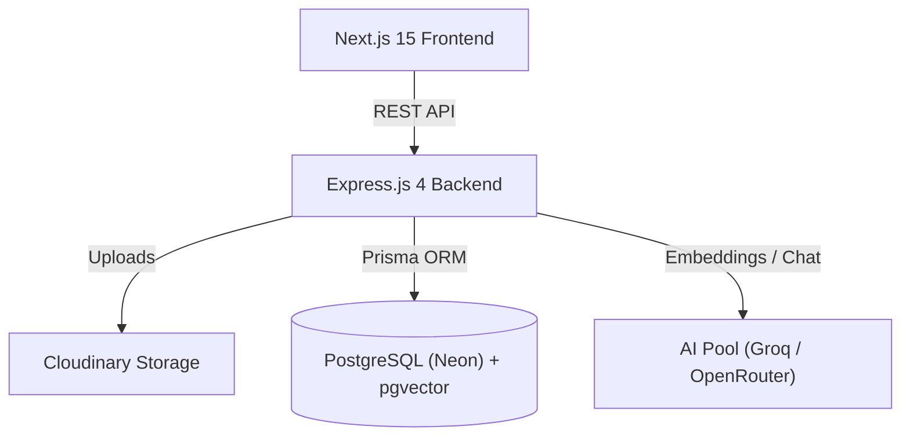
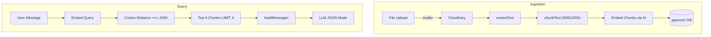
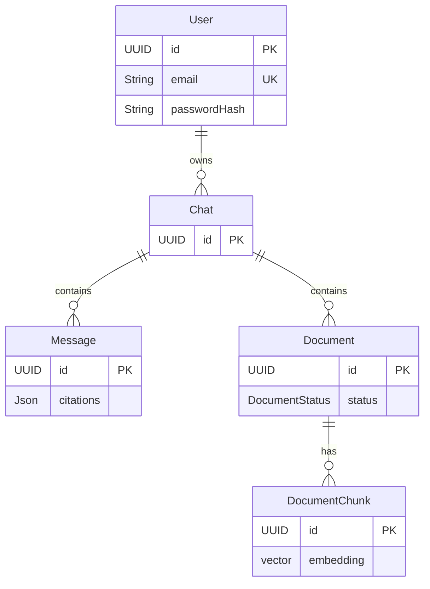

# rag99

> Retrieve first. Generate second. Trust evidence over confidence.

## 1. Project Overview
**rag99** is a full-stack Retrieval-Augmented Generation (RAG) application. It allows users to upload documents, chat with an AI, and receive answers grounded strictly in the provided text. The app leverages a Next.js 15 frontend with an Express.js backend, storing vectorized document chunks in a serverless PostgreSQL database using `pgvector`.

## 2. Problem Statement
Large Language Models hallucinate when answering questions outside their training data or when specific organizational knowledge is required. rag99 solves this by injecting domain-specific context into the LLM's prompt using vector search, ensuring answers are reliable, accurate, and verifiable via citations.

## 3. Core Features
- **Document Ingestion:** Upload PDF, DOCX, TXT, or MD files. Files are parsed using `pdf-parse`, `mammoth`, and UTF-8 decoders.
- **Vector Search:** Documents are chunked (2000 characters, 200 overlap), embedded via OpenRouter (`text-embedding-3-small`), and queried using exact cosine distance in PostgreSQL (`pgvector`).
- **Context-Aware Chat:** Retrieves the top-4 most relevant document chunks and passes them to the LLM (via a multi-provider round-robin pool in `client-pool.ts`) along with the conversation history.
- **Evidence-Based UI:** Features `ContextCards.tsx` and `ThinkingState.tsx` to visualize RAG steps and display citation evidence.

## 4. Architecture Overview



## 5. RAG Pipeline Flow



## 6. Technology Stack

| Category | Technology |
|---|---|
| **Frontend** | Next.js 15 App Router, React 19, TypeScript, Tailwind CSS 3, shadcn/ui |
| **Backend** | Express.js 4, Node.js (ES Modules), TypeScript |
| **Database** | PostgreSQL (Neon serverless), Prisma ORM, pgvector extension (1024-dim) |
| **Auth** | JWT (7-day expiry), bcryptjs, Google OAuth 2.0 |
| **AI Models** | Groq (llama-3.3-70b-versatile), OpenRouter (meta-llama/llama-3.3-70b-instruct, text-embedding-3-small) |
| **Storage** | Cloudinary (raw + image resource types) |

## 7. API Overview

| Method | Path | Purpose | Auth Required |
|---|---|---|---|
| `GET` | `/health` | Health check | No |
| `POST` | `/api/auth/register` | Register new user | No |
| `POST` | `/api/auth/login` | Login user | No |
| `POST` | `/api/auth/google` | Google OAuth | No |
| `GET` | `/api/chats` | List all chats | Yes |
| `POST` | `/api/chats` | Create new chat | Yes |
| `GET` | `/api/chats/:chatId` | Get chat with messages/docs | Yes |
| `PATCH` | `/api/chats/:chatId` | Rename chat | Yes |
| `DELETE`| `/api/chats/:chatId` | Delete chat | Yes |
| `GET` | `/api/chats/:chatId/messages`| List messages | Yes |
| `POST` | `/api/chats/:chatId/messages`| Send RAG query | Yes |
| `GET` | `/api/chats/:chatId/documents`| List documents | Yes |
| `POST` | `/api/chats/:chatId/documents`| Upload document | Yes |
| `DELETE`| `/api/documents/:documentId`| Delete document | Yes |

## 8. Database Schema



## 9. Authentication
- **Local Auth:** Utilizes `bcryptjs` for secure password hashing.
- **OAuth:** Google OAuth 2.0 via tokeninfo endpoint validation.
- **Tokens:** JSON Web Tokens (JWT) issued with a **7-day expiration**.

## 10. Security
- **Rate Limiting:** In-memory map restricting requests to 60 per minute per IP.
- **Validation:** Strict runtime schema validation using `Zod`.
- **CORS:** Configured for the designated frontend origin (default `localhost:3000`).
- **File Uploads:** Memory-based single file upload via `multer` capped at 10MB, restricted by MIME type.

## 11. Error Handling
- **AppError:** Custom error class in `api/src/http/errors.ts` for semantic status codes.
- **asyncHandler:** Wraps asynchronous route handlers to safely catch promise rejections without crashing the server.
- **Global Error Handler:** Gracefully parses `ZodError` formats (400) and `MulterError` (413).

## 12. Environment Configuration
Configuration uses Zod validation via `config.ts`.
- **Database:** `DATABASE_URL`
- **Auth:** `JWT_SECRET`, `GOOGLE_CLIENT_ID`
- **AI:** `AI_BASE_URL`, `AI_API_KEY`, `AI_CHAT_MODEL`, `AI_EMBEDDING_MODEL`, `GROQ_API_KEY`, `OPENROUTER_API_KEY`, `EMBEDDING_DIMENSION` (default 1024)
- **Storage:** `CLOUDINARY_CLOUD_NAME`, `CLOUDINARY_API_KEY`, `CLOUDINARY_API_SECRET`
- **Server:** `PORT`, `CORS_ORIGIN`, `MAX_UPLOAD_MB`

## 13. Repository Structure
```
rag99/
├── api/
│   ├── src/
│   │   ├── ai/ (client-pool.ts, prompt-builder.ts, retrieval.ts)
│   │   ├── db/ (prisma.ts)
│   │   ├── documents/ (extract-text.ts, chunk-text.ts)
│   │   ├── http/ (errors.ts, async-handler.ts)
│   │   ├── middleware/ (auth.ts, error.ts)
│   │   ├── routes/ (auth, chat, document)
│   │   ├── services/
│   │   └── app.ts, server.ts
│   └── prisma/schema.prisma
├── docs/ (Architecture & Design Docs)
└── src/ (Next.js Frontend)
    ├── app/
    │   ├── /login
    │   ├── /register
    │   └── /chats
    │       └── /[chatId]
    └── components/ (Logo, ContextCards, LiquidGlass, etc.)
```

## 14. Local Development Setup
The project runs as an npm workspaces monorepo.
1. Clone the repo.
2. Run `npm install` from the root.
3. Configure your `.env` based on the variables listed above.
4. Run `npm run dev` (utilizes `tsx watch` and `concurrently` to boot both front and backend).

## 15. Documentation
Detailed technical specifications and design documentation can be found in the `docs/` directory:
- [PRD.md](./docs/PRD.md) - Product Requirements Document
- [HLD.md](./docs/HLD.md) - High-Level Design
- [LLD.md](./docs/LLD.md) - Low-Level Design
- [AAD.md](./docs/AAD.md) - API Architecture Document
- [BAD.md](./docs/BAD.md) - Backend Architecture Document
- [FAD.md](./docs/FAD.md) - Frontend Architecture Document
- [VIVA_EVIDENCE.md](./docs/VIVA_EVIDENCE.md) - Concept-to-Implementation Evidence Map

## 16. Version 1 Scope & Limitations
- **Out of Scope for V1:** OCR capabilities, Redis caching, streaming responses, Dockerization, microservices, Kubernetes, MongoDB, hybrid search, Graph RAG, and multi-user collaborative workspaces.
- Document retrieval strictly utilizes top-4 (LIMIT 4) chunk fetching based on exact cosine distance.

## 17. Future Roadmap
- Implementation of real-time streaming LLM responses.
- OCR support for scanned PDFs and image-based text ingestion.
- Hybrid search (BM25 + Vector) to improve retrieval accuracy on keyword-heavy queries.
- Redis-based rate limiting and session management for scaled deployments.
- Docker containers for predictable deployments.
