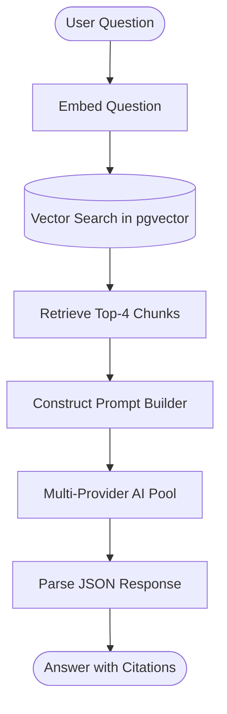

# AI Architecture & Development (AAD)

This document details the Artificial Intelligence and Retrieval-Augmented Generation (RAG) architecture of rag99.

## 1. RAG Pipeline Overview

The system uses a custom-built Retrieval-Augmented Generation pipeline.



## 2. Document Ingestion Pipeline

When a user uploads a document, the system processes it as follows:
1.  **Upload:** Saved to Cloudinary (raw + image resource types).
2.  **Extract:** Text is extracted based on file type.
3.  **Chunk:** Text is split into overlapping chunks.
4.  **Embed:** Each chunk is embedded using the embedding model.
5.  **Store:** Inserted into the `DocumentChunk` table with `::vector`.

## 3. Document Parsing

Implemented in `api/src/documents/extract-text.ts`. Supported formats:
-   **PDF:** Parsed using `pdf-parse`.
-   **DOCX:** Parsed using `mammoth`.
-   **TXT/MD:** Parsed as UTF-8.
-   **Unsupported:** Throws `AppError(415)`.

## 4. Chunking Strategy

Implemented in `api/src/documents/chunk-text.ts`.
-   **Size:** 2000 characters.
-   **Overlap:** 200 characters.
-   **Method:** Sliding window algorithm to preserve context across boundaries.

## 5. Embedding Generation

-   **Model:** OpenRouter (`text-embedding-3-small`).
-   **Dimension:** 1024 dimensions.
-   **Client:** `api/src/ai/client-pool.ts` using `embedRotated()`.

## 6. pgvector Integration

-   **Database:** PostgreSQL with `pgvector` extension.
-   **Metric:** Cosine distance (`<=>`).
-   **Query:** Raw SQL.
-   **Filtering:** Scoped to `chatId`.

## 7. Similarity Search

Implemented in `api/src/ai/retrieval.ts`.
Uses raw SQL to retrieve the top 4 relevant chunks (LIMIT 4) based on cosine distance.
```sql
SELECT dc.content, d."originalName", dc."chunkIndex", dc.embedding <=> $1::vector AS distance 
FROM "DocumentChunk" dc 
JOIN "Document" d ON d.id = dc."documentId" 
WHERE dc."chatId" = $2 AND dc.embedding IS NOT NULL 
ORDER BY dc.embedding <=> $1::vector 
LIMIT $3
```

## 8. Prompt Engineering

Implemented in `api/src/ai/prompt-builder.ts`.
-   System prompts instruct the LLM to output JSON formatting containing `{answer, citations: [{source, chunk}]}`.
-   **Modes:**
    -   `concise`: Max 3 sentences.
    -   `explain`: Structured deep dive.
-   History context is appended to the prompt.

## 9. Structured Output

-   **Enforcement:** `response_format: { type: 'json_object' }`.
-   **Parsing:** `parseAnswer(raw)` parses the JSON, with a fallback to raw string processing if the LLM output is malformed.

## 10. Multi-Provider AI Pool

Implemented in `api/src/ai/client-pool.ts`.
-   **Chat:** Groq (`llama-3.3-70b-versatile`) + OpenRouter (`meta-llama/llama-3.3-70b-instruct`).
-   **Embed:** OpenRouter (`text-embedding-3-small`).
-   **Routing:** Round-robin selection.
-   **Persistence:** Disk-persisted `.pool-index` and `.embed-index` to maintain state across restarts.
-   **Failure Handling:** Rotates to the next provider on failure. Throws `AppError(502)` if all are exhausted.

## 11. Hallucination Mitigation

The system prompt explicitly instructs the LLM to rely only on the provided evidence blocks. Proper citation of chunks and sources is required in the JSON structure.

## 12. Trade-offs

-   **pgvector vs Dedicated Vector DB:** We use pgvector as a single source of truth for relational and vector data, reducing operational overhead, but it may scale less efficiently than specialized vector databases (e.g., Pinecone or Milvus) at massive scales.
-   **Fixed Chunking vs Semantic Chunking:** Sliding window of 2000 chars is simpler to implement but might split natural semantic boundaries unlike semantic-aware chunking.
-   **JSON Mode Limitations:** Not all models strictly follow JSON constraints, necessitating the `parseAnswer` fallback.

## 13. Future Improvements

-   **FUTURE:** Implement semantic chunking.
-   **FUTURE:** Hybrid search (Keyword + Vector).
-   **FUTURE:** Implement Reranking (e.g., Cohere Rerank) to improve retrieval quality.
-   **FUTURE:** Streaming LLM responses instead of waiting for the full generation to complete.
