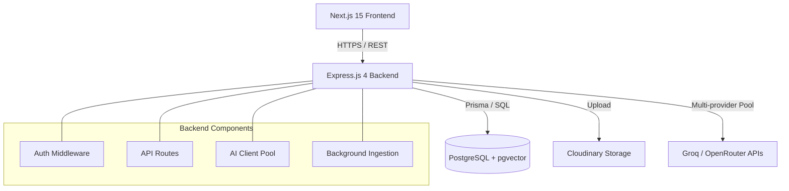
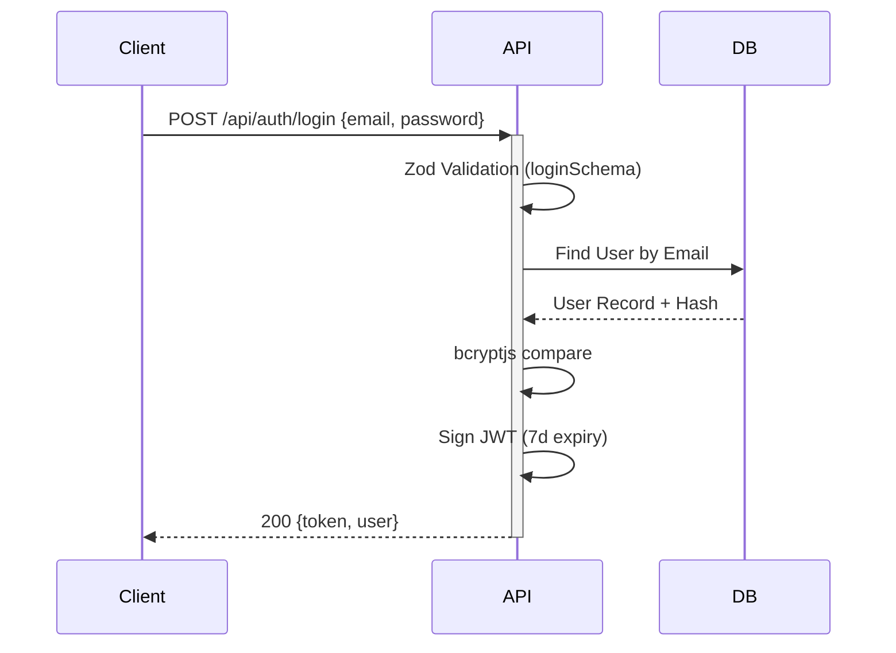
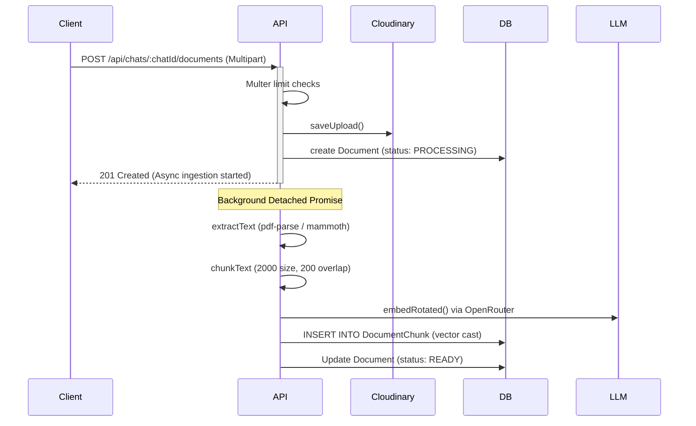
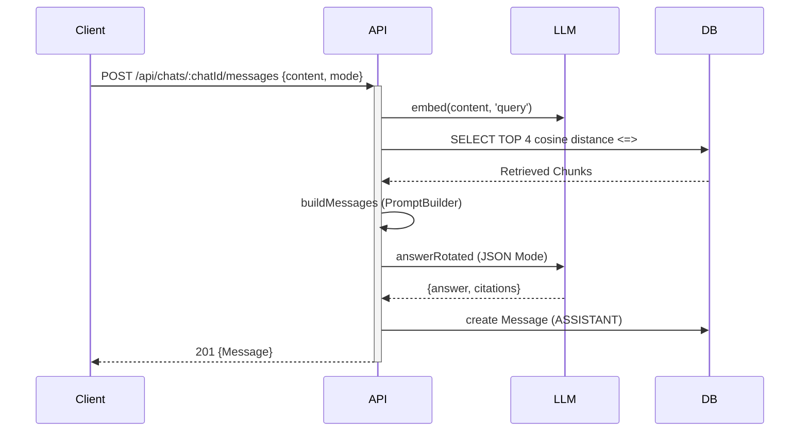
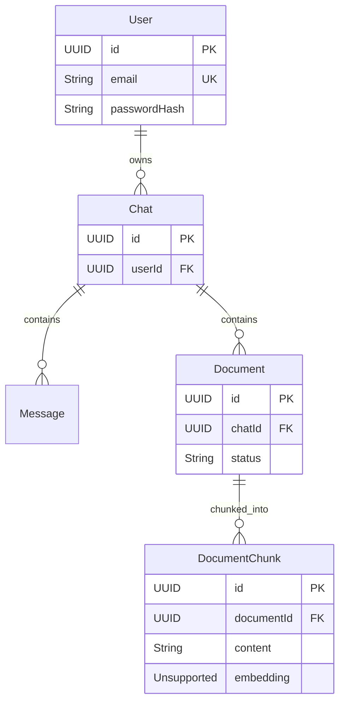

# High-Level Design (HLD)

## 1. Architecture Overview
rag99 is built on a modern full-stack architecture comprising a Next.js 15 App Router frontend and an Express.js 4 backend. It uses a serverless PostgreSQL database (Neon) augmented with `pgvector` for vector similarity search. The application leverages a robust multi-provider AI client pool to ensure high availability for embedding and LLM completions.

## 2. System Architecture Diagram



## 3. Component Diagram

```mermaid
graph TD
    subgraph Frontend (Next.js)
        Context[ChatContext]
        UI[shadcn/ui + Tailwind]
        ClientAPI[web/lib/api.ts]
    end
    
    subgraph Backend (Express.js)
        AuthService[auth.service.ts]
        ChatRoutes[chat.routes.ts]
        PromptBuilder[prompt-builder.ts]
        AIPool[client-pool.ts]
    end
    
    UI --> Context
    Context --> ClientAPI
    ClientAPI --> ChatRoutes
    ChatRoutes --> AuthService
    ChatRoutes --> PromptBuilder
    PromptBuilder --> AIPool
```

## 4. System Components
- **Frontend (WHAT):** Next.js 15 React application. **(WHERE):** `web/` directory. **(HOW):** Uses Context API (`ChatContext`) for state, Tailwind/shadcn for UI. **(WHY):** Provides a modern, responsive user experience.
- **Backend API (WHAT):** Node.js Express 4 server. **(WHERE):** `api/src/`. **(HOW):** REST endpoints validated by Zod. **(WHY):** Robust routing and middleware support.
- **Database (WHAT):** PostgreSQL with Neon serverless and pgvector. **(WHERE):** Connected via Prisma ORM. **(HOW):** Stores relational data and 1024-dim embeddings. **(WHY):** Unified storage for metadata and vector search.
- **AI Pool (WHAT):** Multi-provider round-robin pool. **(WHERE):** `api/src/ai/client-pool.ts`. **(HOW):** Rotates through Groq and OpenRouter keys. **(WHY):** Prevents single point of failure.

## 5. Request Flows

### Authentication Flow (Email/Password)


### Document Upload & Ingestion Flow


### RAG Query Flow


## 6. Data Flow
Data enters via standard HTTP JSON payloads or multipart forms. Express limits JSON to 1MB. Validation occurs via Zod schemas (`api/src/schemas.ts`). Parsed text is chunked and sent to OpenRouter for embedding (1024 dimensions) before storage in `DocumentChunk`.

## 7. AI Architecture
- **WHAT:** Intelligent text generation and semantic embedding.
- **WHERE:** `api/src/ai/client-pool.ts`, `api/src/ai/prompt-builder.ts`
- **HOW:** Uses `text-embedding-3-small` (1024 dims) for embeddings. Generates completions using JSON mode `{type:'json_object'}` via Groq (`llama-3.3-70b-versatile`) or OpenRouter (`meta-llama/llama-3.3-70b-instruct`). Uses `.pool-index` to track rotation state.
- **WHY:** JSON mode guarantees parseable output for the `{answer, citations}` schema. Multi-provider rotation guarantees resilience.

## 8. Database Architecture


*Note: All foreign keys utilize `ON DELETE CASCADE`.*

## 9. Security Architecture
- **Auth:** JWT tokens (7 days expiry), generated and verified in `api/src/middleware/auth.ts`.
- **Hashing:** Passwords hashed with `bcryptjs` (12 rounds).
- **Validation:** Strict runtime validation using Zod schemas (`authSchema`, `chatParamsSchema`).
- **Rate Limiting:** In-memory map (IP-based) blocking > max requests per window.
- **Storage Limits:** Multer limits file size and types (pdf, txt, md, docx).

## 10. Deployment Architecture
Designed for a streamlined development setup using `npm workspaces` monorepo.
- `tsx watch` for hot-reloading the backend.
- `concurrently` for running frontend and backend simultaneously.

## 11. Major Design Decisions

| Decision | Alternatives Considered | Trade-off / Rationale |
|----------|-------------------------|------------------------|
| **PostgreSQL + pgvector** | Pinecone, Redis, MongoDB | **PRO:** Single datastore, atomic transactions, foreign keys. **CON:** Slightly slower ANN search at massive scale (acceptable for V1). |
| **Express.js API** | Next.js API Routes | **PRO:** Clear separation of concerns, easier background task management. **CON:** Requires separate server process. |
| **In-Memory Rate Limit** | Redis | **PRO:** Zero dependency, easy local dev. **CON:** State lost on restart, doesn't scale horizontally. |
| **Multi-Provider Pool** | Single OpenAI / Groq API | **PRO:** High availability, bypass rate limits. **CON:** Complex local index management (`.pool-index`). |
| **Async Background Ingestion** | Synchronous wait | **PRO:** Immediate 201 response, fast UI. **CON:** User must poll or wait to see processing complete. |

## 12. Scalability & Future Improvements (FUTURE)
- **Redis Integration (FUTURE):** For distributed rate limiting and persistent background job queues (e.g., BullMQ) instead of detached Promises.
- **Streaming (FUTURE):** True SSE stream implementation for token-by-token UI updates, replacing the current blocking JSON-mode generation.
- **Microservices (FUTURE):** Extracting document ingestion into a standalone worker service to scale independently of the main API.
- **Dockerization (FUTURE):** Adding Dockerfiles and `docker-compose` for unified deployments.
