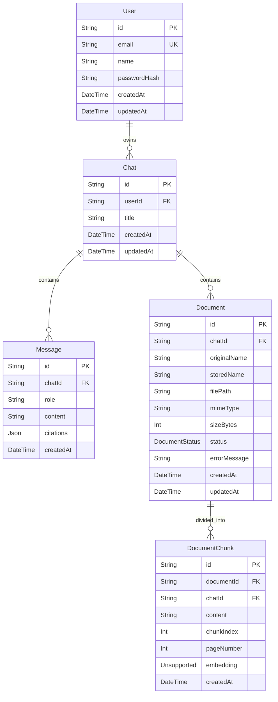

# Low Level Design (LLD) - rag99

## 1. Project Overview
This document details the Low-Level Design (LLD) for the rag99 project. It provides an in-depth look at the implementation details, including folder structures, database schema, API specifications, and architectural choices. This document acts as the primary technical reference for the implemented features in Version 1.

## 2. Backend Folder Structure
The backend is structured as an Express application using Prisma for database access.

```text
api/
  prisma/
    schema.prisma
    migrations/
  src/
    server.ts          # Entry point, starts Express on env.PORT
    app.ts             # Express app config: cors, json, rateLimit, routes, errorHandler
    config.ts          # Zod-validated env vars loaded from .env via dotenv
    schemas.ts         # Zod request validation schemas
    self-check.ts      # Smoke test for chunking and JSON parsing
    db/
      prisma.ts        # Singleton PrismaClient export
    ai/
      ai-client.ts     # Facade: embed() and answer() -> client-pool
      client-pool.ts   # Multi-provider round-robin (Groq + OpenRouter), disk-persisted index
      prompt-builder.ts # buildMessages() and parseAnswer() for RAG prompts
      retrieval.ts     # pgvector cosine distance raw SQL query
    documents/
      file-storage.ts  # Cloudinary upload/delete with stream API
      extract-text.ts  # pdf-parse, mammoth, UTF-8 text extraction
      chunk-text.ts    # Fixed-size sliding window chunker (2000/200)
    http/
      errors.ts        # AppError class + errorResponse() normalizer
      async-handler.ts # Promise.resolve().catch(next) wrapper
    middleware/
      auth.ts          # JWT Bearer verification, req.user attachment
      error.ts         # Global ErrorRequestHandler
      rate-limit.ts    # In-memory IP-based rate limiter (Map)
    routes/
      auth.routes.ts   # POST /register, /login, /google
      chat.routes.ts   # Full CRUD + messages + documents (multer)
      document.routes.ts # DELETE /:documentId
    services/
      auth.service.ts  # register, login, loginWithGoogle (bcryptjs, JWT, Google tokeninfo)
      chat.service.ts  # listChats, createChat, getChat, ownedChat, renameChat, deleteChat
      document.service.ts # listDocuments, addDocument (with background ingestion), removeDocument
      message.service.ts  # listMessages, ask (full RAG pipeline)
```

## 3. Frontend Folder Structure
The frontend is built using Next.js App Router.

```text
web/
  app/
    layout.tsx         # Root layout, Google Identity Services script injection
    page.tsx           # / redirect to /chats
    globals.css        # Tailwind directives, custom keyframes, scrollbar styles
    login/
      page.tsx         # Email/password + Google OAuth login
    register/
      page.tsx         # Name/email/password + Google OAuth register
    chats/
      layout.tsx       # Sidebar + ChatContext.Provider wrapper
      context.tsx      # ChatContext definition + useChatContext hook
      page.tsx         # Welcome screen with suggested prompts
      [chatId]/
        page.tsx       # Active chat: messages, RAG loading, documents, citations
  components/
    Logo.tsx           # SVG brand logo
    LiquidGlass.tsx    # Glassmorphic UI primitives (5 exports)
    LoadingState.tsx   # Pixel-grid animated loader (Drive/Dots/Orbit)
    StreamingText.tsx  # Typewriter text reveal with citation preprocessing
    ThinkingState.tsx  # RAG execution trace visualization
    ContextCards.tsx   # Retrieved evidence chunk display cards
    ui/
      button.tsx       # Base button primitive
      input.tsx        # Base input primitive
  lib/
    api.ts             # fetch wrapper with JWT injection, 401 redirect, FormData detection
    types.ts           # Chat, Document, CitationType, Message types
```

## 4. Database Schema

### ER Diagram


### Complete Prisma Schema
Implemented in `api/prisma/schema.prisma`.

```prisma
generator client {
  provider = "prisma-client-js"
}

datasource db {
  provider = "postgresql"
  url      = env("DATABASE_URL")
}

model User {
  id           String   @id @default(uuid())
  email        String   @unique
  name         String
  passwordHash String
  chats        Chat[]
  createdAt    DateTime @default(now())
  updatedAt    DateTime @updatedAt
}

model Chat {
  id        String     @id @default(uuid())
  userId    String
  user      User       @relation(fields: [userId], references: [id], onDelete: Cascade)
  title     String     @default("New chat")
  messages  Message[]
  documents Document[]
  createdAt DateTime   @default(now())
  updatedAt DateTime   @updatedAt
  @@index([userId])
}

model Message {
  id        String   @id @default(uuid())
  chatId    String
  chat      Chat     @relation(fields: [chatId], references: [id], onDelete: Cascade)
  role      String
  content   String
  citations Json?
  createdAt DateTime @default(now())
  @@index([chatId, createdAt])
}

model Document {
  id           String         @id @default(uuid())
  chatId       String
  chat         Chat           @relation(fields: [chatId], references: [id], onDelete: Cascade)
  originalName String
  storedName   String
  filePath     String
  mimeType     String
  sizeBytes    Int
  status       DocumentStatus @default(PROCESSING)
  errorMessage String?
  chunks       DocumentChunk[]
  createdAt    DateTime       @default(now())
  updatedAt    DateTime       @updatedAt
  @@index([chatId])
}

model DocumentChunk {
  id         String   @id @default(uuid())
  documentId String
  document   Document @relation(fields: [documentId], references: [id], onDelete: Cascade)
  chatId     String
  content    String
  chunkIndex Int
  pageNumber Int?
  embedding  Unsupported("vector(1024)")
  createdAt  DateTime @default(now())
  @@index([documentId])
  @@index([chatId])
}

enum DocumentStatus {
  PROCESSING
  READY
  FAILED
}
```

### Table Descriptions
- **User**: Stores user account details. PK `id` (UUID), unique index on `email`. `passwordHash` stores the bcryptjs hash.
- **Chat**: Groups conversations and documents. PK `id`, FK `userId` (cascades on delete). Indexed by `userId` for fast lookups.
- **Message**: Stores individual conversation turns. PK `id`, FK `chatId` (cascades on delete). Indexed by `[chatId, createdAt]` to quickly load chat history in chronological order.
- **Document**: Represents an uploaded file. PK `id`, FK `chatId` (cascades on delete). Tracks file processing `status`. Indexed by `chatId`.
- **DocumentChunk**: Stores parsed text chunks and pgvector embeddings. PK `id`, FK `documentId` (cascades on delete). `embedding` field uses raw PostgreSQL `vector(1024)`. Indexed by `documentId` and `chatId`.

## 5. API Endpoint Specification

### POST /api/auth/register
- **Path:** `/api/auth/register`
- **Purpose:** Register a new user account.
- **Auth:** None
- **Validation Schema:** `authSchema` (email, password min 8, name optional)
- **Implementation File:** `api/src/routes/auth.routes.ts`, `api/src/services/auth.service.ts`
- **Response:** 201 Created on success, 409 Conflict if email exists, 400 Bad Request on validation failure.

### POST /api/auth/login
- **Path:** `/api/auth/login`
- **Purpose:** Authenticate a user and issue a JWT.
- **Auth:** None
- **Validation Schema:** `loginSchema` (email, password min 8)
- **Implementation File:** `api/src/routes/auth.routes.ts`, `api/src/services/auth.service.ts`
- **Response:** 200 OK with token, 401 Unauthorized for invalid credentials.

### POST /api/auth/google
- **Path:** `/api/auth/google`
- **Purpose:** Login or register a user using Google OAuth.
- **Auth:** None
- **Validation Schema:** Inline `z.object({credential: z.string().min(1)})`
- **Implementation File:** `api/src/routes/auth.routes.ts`, `api/src/services/auth.service.ts`
- **Response:** 200 OK with token, 401 Unauthorized if Google token validation fails.

### GET /api/chats
- **Path:** `/api/chats`
- **Purpose:** Retrieve all chats for the authenticated user.
- **Auth:** Required (`requireAuth`)
- **Validation Schema:** None
- **Implementation File:** `api/src/routes/chat.routes.ts`, `api/src/services/chat.service.ts`
- **Response:** 200 OK returning `Chat[]`.

### POST /api/chats
- **Path:** `/api/chats`
- **Purpose:** Create a new chat session.
- **Auth:** Required (`requireAuth`)
- **Validation Schema:** Optional title in body.
- **Implementation File:** `api/src/routes/chat.routes.ts`, `api/src/services/chat.service.ts`
- **Response:** 201 Created returning `Chat`.

### GET /api/chats/:chatId
- **Path:** `/api/chats/:chatId`
- **Purpose:** Retrieve details of a specific chat including messages and documents.
- **Auth:** Required (`requireAuth`)
- **Validation Schema:** `chatParamsSchema`
- **Implementation File:** `api/src/routes/chat.routes.ts`, `api/src/services/chat.service.ts`
- **Response:** 200 OK returning `Chat` with nested relations, 404 Not Found if chat doesn't exist or isn't owned by user.

### PATCH /api/chats/:chatId
- **Path:** `/api/chats/:chatId`
- **Purpose:** Rename a chat.
- **Auth:** Required (`requireAuth`)
- **Validation Schema:** `chatParamsSchema` + `titleSchema`
- **Implementation File:** `api/src/routes/chat.routes.ts`, `api/src/services/chat.service.ts`
- **Response:** 200 OK returning updated `Chat`.

### DELETE /api/chats/:chatId
- **Path:** `/api/chats/:chatId`
- **Purpose:** Delete a chat and cascade delete its messages, documents, and chunks.
- **Auth:** Required (`requireAuth`)
- **Validation Schema:** `chatParamsSchema`
- **Implementation File:** `api/src/routes/chat.routes.ts`, `api/src/services/chat.service.ts`
- **Response:** 204 No Content.

### GET /api/chats/:chatId/messages
- **Path:** `/api/chats/:chatId/messages`
- **Purpose:** Retrieve chat messages.
- **Auth:** Required (`requireAuth`)
- **Validation Schema:** `chatParamsSchema`
- **Implementation File:** `api/src/routes/chat.routes.ts`, `api/src/services/message.service.ts`
- **Response:** 200 OK returning `Message[]`.

### POST /api/chats/:chatId/messages
- **Path:** `/api/chats/:chatId/messages`
- **Purpose:** Submit a question, run RAG pipeline, and generate AI answer.
- **Auth:** Required (`requireAuth`)
- **Validation Schema:** `chatParamsSchema` + `messageSchema`
- **Implementation File:** `api/src/routes/chat.routes.ts`, `api/src/services/message.service.ts`
- **Response:** 201 Created returning `Message` with citations.

### GET /api/chats/:chatId/documents
- **Path:** `/api/chats/:chatId/documents`
- **Purpose:** Retrieve documents attached to a chat.
- **Auth:** Required (`requireAuth`)
- **Validation Schema:** `chatParamsSchema`
- **Implementation File:** `api/src/routes/chat.routes.ts`, `api/src/services/document.service.ts`
- **Response:** 200 OK returning `Document[]`.

### POST /api/chats/:chatId/documents
- **Path:** `/api/chats/:chatId/documents`
- **Purpose:** Upload a document to a chat and trigger background processing.
- **Auth:** Required (`requireAuth`)
- **Validation Schema:** `chatParamsSchema` + `multer.single('file')`
- **Implementation File:** `api/src/routes/chat.routes.ts`, `api/src/services/document.service.ts`
- **Response:** 201 Created returning `Document` in `PROCESSING` status.

### DELETE /api/documents/:documentId
- **Path:** `/api/documents/:documentId`
- **Purpose:** Delete a document and its resources from DB and Cloudinary.
- **Auth:** Required (`requireAuth`)
- **Validation Schema:** `documentParamsSchema`
- **Implementation File:** `api/src/routes/document.routes.ts`, `api/src/services/document.service.ts`
- **Response:** 204 No Content.

## 6. Validation Documentation

Implemented centrally in `api/src/schemas.ts`. Zod is used for input validation.

**Zod Schemas:**
- `authSchema`: `{email: z.string().email(), password: z.string().min(8), name: z.string().trim().min(1).max(80).optional()}`
- `loginSchema`: `{email: z.string().email(), password: z.string().min(8)}`
- `titleSchema`: `{title: z.string().trim().min(1).max(100)}`
- `messageSchema`: `{content: z.string().trim().min(1).max(10000), mode: z.enum(['concise','explain']).default('concise')}`
- `chatParamsSchema`: `{chatId: z.string().uuid()}`
- `documentParamsSchema`: `{documentId: z.string().uuid()}`

Validation happens at the route handler level using `schema.parse()`. If validation fails, Zod throws a `ZodError` which is caught by the `asyncHandler` and passed to the global error handler. The `errorResponse()` normalizes the output to HTTP 400 with flattened error details.

## 7. Authentication Implementation

- **Registration Flow:** Client sends payload. `auth.service.register()` checks for duplicate email (throws 409 if found). Hashes password with `bcryptjs.hash(12)`. Creates user in Prisma. Signs JWT with `{sub: id, email}` valid for 7 days (`7d`). Returns 201.
- **Login Flow:** `auth.service.login()` finds user by email. Verifies password using `bcryptjs.compare`. Signs JWT valid for 7 days. Returns 200.
- **Google OAuth Flow:** `auth.service.loginWithGoogle()` receives token. Fetches tokeninfo from Google. Validates `aud` matches `GOOGLE_CLIENT_ID` and `email_verified` is true. Upserts user in Prisma. Signs JWT valid for 7 days. Returns 200.
- **Middleware (`api/src/middleware/auth.ts`):** Verifies the Bearer JWT token, attaches `req.user`, and passes execution.
- **Library:** `bcryptjs` for hashing (not `bcrypt`). `jsonwebtoken` for tokens.

## 8. Error Handling Architecture

- **AppError Class (`api/src/http/errors.ts`):** Custom Error extension holding an HTTP status code.
- **errorResponse Function (`api/src/http/errors.ts`):** Discriminates errors into a normalized JSON payload. Handles `AppError`, `ZodError`, Multer's `LIMIT_FILE_SIZE` (413), and unhandled exceptions (500 + console log).
- **asyncHandler (`api/src/http/async-handler.ts`):** Wraps Express route handlers in `Promise.resolve(fn(req, res, next)).catch(next)` to route async errors to middleware.
- **errorHandler (`api/src/middleware/error.ts`):** Global Express error middleware mapping errors through `errorResponse()`.

## 9. Rate Limiting

- **Implementation (`api/src/middleware/rate-limit.ts`):** In-memory Map structure utilizing the client IP address as the key.
- **Config:** Limits (max requests and window duration) loaded from environment variables via Zod.
- **Trade-off:** In-memory map vs Redis. *Rationale:* Chosen for simplicity and ease of deployment for Version 1. *Limitation:* State is not shared across multi-node deployments. *Future improvement:* Replace Map with Redis for distributed environments.

## 10. File Upload & Storage

- **Multer:** Configured in `api/src/routes/chat.routes.ts` with memory storage. Filters on accepted MIME types and limits payload size.
- **Cloudinary (`api/src/documents/file-storage.ts`):** Uses Cloudinary upload stream to bypass saving to local disk.
- **Operations:** Handles upload and deletion by public ID.

## 11. Document Processing Pipeline

1. **Extraction (`api/src/documents/extract-text.ts`):** Parses raw files into UTF-8 text using `pdf-parse` (PDF) or `mammoth` (DOCX). Fallback for text files.
2. **Chunking (`api/src/documents/chunk-text.ts`):** Splits text into chunks using a fixed-size sliding window (2000 character length, 200 character overlap).
3. **Embedding:** Iterates over chunks and generates embeddings using the AI client pool.
4. **Vector Storage:** Inserts text and vectors into DB using raw SQL with pgvector `::vector(1024)` casting.
5. **Lifecycle:** Document is initially marked `PROCESSING`. Once complete, marked `READY`. If any step throws an error, marked `FAILED` with `errorMessage` saved.

## 12. RAG Query Pipeline

Implemented primarily in `api/src/services/message.service.ts` `ask()` function.

**Flow:**
1. Authorize user and retrieve chat context (`ownedChat`).
2. Save the User's message via Prisma.
3. Conditionally auto-rename the chat title based on content.
4. Generate an embedding for the user's query (`ai-client.embed`).
5. Perform retrieval (`api/src/ai/retrieval.ts`): Raw SQL query performing cosine distance (`<=>`) vector similarity search, JOINed with Document for metadata, returning `LIMIT 4`.
6. Retrieve previous chat history for LLM context.
7. Construct the prompt using `buildMessages()` (`api/src/ai/prompt-builder.ts`): combines System instructions (JSON output only), retrieved context blocks, history, and the new query.
8. Ask LLM in JSON mode (`ai-client.answer`).
9. Parse the LLM's raw response string into structured `{answer, citations}` using `parseAnswer()` (includes JSON fallback handling).
10. Enrich the raw citations with actual chunk content snippets.
11. Save the Assistant's message and enriched citations to Prisma.
12. Return the Assistant message to the user.

## 13. AI Provider Architecture

- **Client Pool (`api/src/ai/client-pool.ts`):** Implements multi-provider round-robin logic for both chat generation and embeddings to handle rate limits and availability.
- **Configuration:** 
  - Chat models: `llama-3.3-70b-versatile` (Groq), `llama-3.3-70b-instruct` (OpenRouter via multiple keys).
  - Embedding models: `text-embedding-3-small` (OpenRouter via multiple keys).
- **Persistence:** Current active provider index is persisted locally to `.pool-index` and `.embed-index` files so rotation survives restarts.
- **Failover:** On request failure, the pool automatically advances to the next provider and retries. If all providers are exhausted, an `AppError(502)` is thrown.

## 14. Frontend Architecture

- **Framework:** Next.js App Router.
- **Routing:** `/login`, `/register`, `/chats` (main dashboard), `/chats/[chatId]` (specific conversation). (Actual routes, not using route groups).
- **State Management:** `ChatContext` for global application state (sidebar chats, loading state). Extensive use of local `useState` per-page for UI ephemeral state (messages, document upload panel, streaming, citations).
- **API Client (`web/lib/api.ts`):** Native `fetch` wrapper. Automatically reads JWT from `localStorage`, injects `Authorization: Bearer <token>`, manages JSON vs FormData body types, and globally traps 401s to redirect users to `/login`.
- **Component Hierarchy:** Layouts wrap context. Pages utilize bespoke UI components (`LoadingState`, `StreamingText`, `ThinkingState`, `ContextCards`, `LiquidGlass`).
- **Polling:** The active chat view (`chats/[chatId]/page.tsx`) uses a `useEffect` timer to poll `/api/chats/:chatId/documents` every 3000ms if any document exhibits a `PROCESSING` status, stopping when all resolve to `READY` or `FAILED`.

## 15. Environment Configuration

- Boot-time validation via Zod in `api/src/config.ts`.
- Categories: Database URL, JWT secrets, AI API keys (Groq, OpenRouter), Cloudinary storage settings, rate limit bounds, and Express config.
- `dotenv` loads `.env`. Missing or invalid configurations abort startup immediately.

## 16. HTTP Status Codes

| Code | Meaning | Usage Scenario |
|---|---|---|
| **200** | OK | Standard successful GET requests, successful login, updates. |
| **201** | Created | Resource successfully created (User registration, Chat creation, Message sent, Document uploaded). |
| **204** | No Content | Successful deletion of a Chat or Document. |
| **400** | Bad Request | Validation errors from Zod payload schemas. |
| **401** | Unauthorized | Missing/invalid JWT, incorrect credentials, failed Google OAuth. |
| **404** | Not Found | Requested entity (Chat, Document) does not exist or user lacks ownership. |
| **409** | Conflict | Duplicate email detected during user registration. |
| **413** | Payload Too Large | Uploaded file exceeds Multer constraints. |
| **415** | Unsupported Media Type | Multer rejects file extension/MIME type. |
| **429** | Too Many Requests | User/IP exceeded configured rate limits. |
| **500** | Internal Server Error | Unhandled server exception. |
| **502** | Bad Gateway | Total exhaustion of AI client pool (no providers succeeded). |

## 17. Trade-offs & Design Decisions

### A. In-Memory Rate Limiting
- **Approach:** Map object tracking IP requests.
- **Rationale:** Minimizes infrastructural dependencies for initial deployment.
- **Alternative:** Redis.
- **Limitation:** Counters reset on restart; ineffective across multiple load-balanced Node instances.
- **Future Improvement:** Implement a Redis-backed rate limiter (e.g. `rate-limit-redis`).

### B. Fixed-Size Chunking Window
- **Approach:** Sliding window chunker (2000 chars length, 200 overlap).
- **Rationale:** Easy to implement, guarantees chunk sizes fit embedding model constraints.
- **Alternative:** Semantic chunking via Langchain or NLP sentence boundaries.
- **Limitation:** Can awkwardly split context midway through a sentence or code block.
- **Future Improvement:** Adopt semantic boundaries or recursive chunking mechanisms.

### C. Cloudinary Over Local S3 Storage
- **Approach:** Streaming upload to Cloudinary.
- **Rationale:** Zero dev-ops overhead for file hosting and deletion in early stages.
- **Alternative:** Self-hosted MinIO or AWS S3.
- **Limitation:** Cloudinary isn't typically designed for raw generic document hosting compared to image/video media.
- **Future Improvement:** Migrate object storage to an S3-compatible provider.

### D. File-Based Client Pool Persistence
- **Approach:** Saving current provider indices to `.pool-index` and `.embed-index` on disk.
- **Rationale:** Simplest method to persist rotation state across Dev server reloads or minor restarts without a cache database.
- **Alternative:** Redis or PostgreSQL atomic updates.
- **Limitation:** High I/O overhead on concurrent requests; useless in stateless/serverless environments.
- **Future Improvement:** Shift rotation state to Redis.
